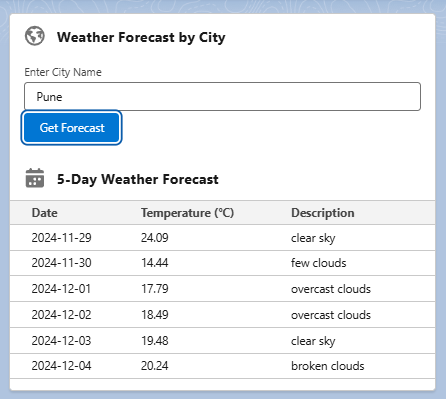

# 🌦️ **Weather Forecast LWC Project** 🌍

### **Overview** 🚀

Welcome to the **Weather Forecast LWC Project**! This Salesforce Lightning Web Component (LWC) app connects to the [OpenWeather API](https://openweathermap.org/api) to bring you **real-time weather updates**. The app lets you:
- Fetch a **5-day weather forecast** by entering a **city name** 🌆.
- Automatically fetch weather data based on the **Billing City** of an **Account** record 🏢.

---

### **Key Features** ✨

1. **City-Based Weather Forecast** 🌇:
   - Enter a city name to get a **5-day weather forecast**.
   - Displays temperature, date, and weather conditions in a **user-friendly table**.

2. **Billing City-Based Weather Forecast** 🏙️:
   - Automatically fetches weather data for the **Billing City** of an `Account` record.
   - Perfect for Account-specific insights! 🗺️

3. **Reusable Weather Table** 🔄:
   - A **reusable** LWC component that can be used across different parts of your app to display weather data.

---

### **How It Works** 🔄

1. **City-Based Forecast** 🌇:
   - Go to the page with `searchWeather` and enter a city name.
   - Click **Search** to display the 5-day forecast in a table.

2. **Billing City Forecast** 🏙️:
   - Go to an `Account` record that has the `Billing City` filled.
   - The `weatherForecastByBillingCity` component will automatically show the weather for the **Billing City**.

---

### **Screenshots** 📸

#### City-Based Weather Forecast


#### Billing City Weather Forecast


---

### **Project Structure** 📂
```
Weather-Forecast-LWC/
├── force-app/
│   └── main/
│       └── default/
│           ├── aura/
│           ├── classes/
│           │   └── WeatherForecastController.cls
│           ├── lwc/
│           │   ├── SearchWeatherForecoast/
│           │   ├── ForecastByBillingCity/
│           │   └── WeatherTableForecast/
│           └── layouts/
├── .gitignore
├── README.md
└── images/
    ├── SearchWeather.png
    └── BillingCity.png
```

---

### **Setup Instructions** 🛠️

#### **1. Prerequisites** 📋
- **Salesforce Developer Org** or **Sandbox** (Make sure you have **API access** enabled).
- [Salesforce CLI](https://developer.salesforce.com/tools/sfdxcli) installed.
- **OpenWeather API Key** (Sign up [here](https://openweathermap.org/api) to get one).

#### **2. Clone the Repo** 📥
```bash
git clone https://github.com/KislayKashyap-hub/Weather-Forecast-LWC.git
cd Weather-Forecast-LWC
```

#### **3. Deploy to Salesforce** 🚀
```bash
sfdx force:source:deploy -p force-app
```

#### **4. Add Remote Site Settings** 🔧
Go to **Setup** → **Remote Site Settings** → **New Remote Site** and add:
- **Name**: `OpenWeatherAPI`
- **URL**: `https://api.openweathermap.org`

#### **5. Replace API Key** 🔑
Replace `YOUR_API_KEY` in the `WeatherController` Apex class with your actual OpenWeather API key:
```apex
String endpoint = 'https://api.openweathermap.org/data/2.5/forecast?q=' + cityName + '&appid=YOUR_API_KEY&units=metric';
```

#### **6. Assign Components** 🔲
- **Search Weather Component**: Add `searchWeather` to any Lightning App Page.
- **Billing City Weather Component**: Add `weatherForecastByBillingCity` to an `Account` Lightning Record Page.

---

### **Improvements & Future Enhancements** 🚧

- **Error Handling**: Add better handling for incorrect city names or empty `BillingCity`.
- **Secure the API Key**: Use Salesforce **Custom Metadata** or **Custom Settings** for storing the API key securely.
- **UI Enhancements**: Display more weather details like wind speed, humidity, etc.
- **Test Classes**: Improve the test coverage for Apex code to ensure reliability.

---

### **License** 📜
This project is licensed under the **MIT License**. See the [LICENSE](LICENSE) file for details.

---

### **Contributing** 🤝
Contributions are welcome! Feel free to fork the repository, create a new branch, and submit a pull request.

---

### **Contact** 📬

You can reach out to me on the following platforms:

- 📧 **Email**: [kislay.tech@gmail.com](mailto:kislay.tech@gmail.com)
- 🌐 **LinkedIn**: [Kislay Kumar](https://www.linkedin.com/in/kislay-kumar-kk/)
- 🔗 **Trailhead**: [Kislay Kumar on Trailhead](https://www.salesforce.com/trailblazer/g88z22m1ullatkw2wr)

---

### **Connect & Follow** 🌍

Let’s stay connected and keep building amazing projects together! 🚀
